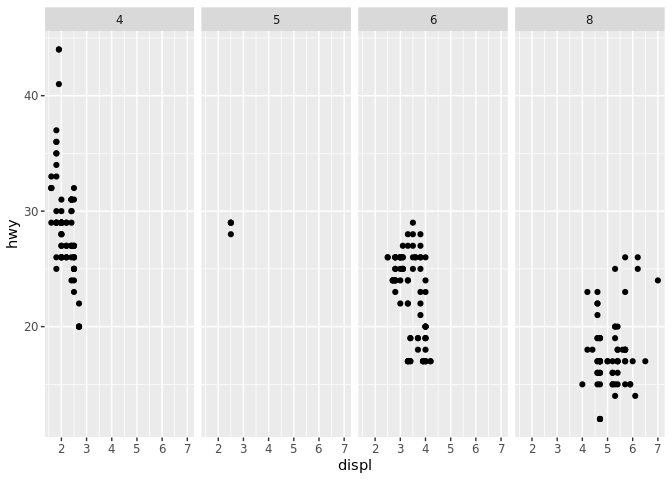
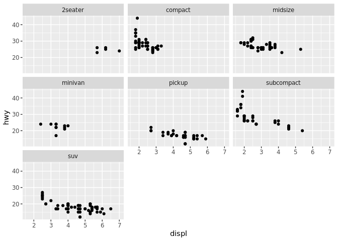

Visualize Data
================
Kourtney Burger
9/17/19

Your Turn 0
-----------

Add a setup chunk that loads the tidyverse packages.

``` r
library(tidyverse)
```

    ## Registered S3 method overwritten by 'dplyr':
    ##   method               from  
    ##   as.data.frame.tbl_df tibble

    ## Registered S3 methods overwritten by 'ggplot2':
    ##   method         from 
    ##   [.quosures     rlang
    ##   c.quosures     rlang
    ##   print.quosures rlang

    ## ── Attaching packages ───────────────────────────────────────────────── tidyverse 1.2.1 ──

    ## ✔ ggplot2 3.0.0     ✔ purrr   0.2.5
    ## ✔ tibble  1.4.2     ✔ dplyr   0.7.6
    ## ✔ tidyr   0.8.3     ✔ stringr 1.3.1
    ## ✔ readr   1.1.1     ✔ forcats 0.3.0

    ## ── Conflicts ──────────────────────────────────────────────────── tidyverse_conflicts() ──
    ## ✖ dplyr::filter() masks stats::filter()
    ## ✖ dplyr::lag()    masks stats::lag()

``` r
mpg
```

    ## # A tibble: 234 x 11
    ##    manufacturer model displ  year   cyl trans drv     cty   hwy fl    cla…
    ##    <chr>        <chr> <dbl> <int> <int> <chr> <chr> <int> <int> <chr> <ch>
    ##  1 audi         a4      1.8  1999     4 auto… f        18    29 p     com…
    ##  2 audi         a4      1.8  1999     4 manu… f        21    29 p     com…
    ##  3 audi         a4      2    2008     4 manu… f        20    31 p     com…
    ##  4 audi         a4      2    2008     4 auto… f        21    30 p     com…
    ##  5 audi         a4      2.8  1999     6 auto… f        16    26 p     com…
    ##  6 audi         a4      2.8  1999     6 manu… f        18    26 p     com…
    ##  7 audi         a4      3.1  2008     6 auto… f        18    27 p     com…
    ##  8 audi         a4 q…   1.8  1999     4 manu… 4        18    26 p     com…
    ##  9 audi         a4 q…   1.8  1999     4 auto… 4        16    25 p     com…
    ## 10 audi         a4 q…   2    2008     4 manu… 4        20    28 p     com…
    ## # ... with 224 more rows

Your Turn 1
-----------

Run the code on the slide to make a graph. Pay strict attention to spelling, capitalization, and parentheses!

Your Turn 2
-----------

Replace this scatterplot with one that draws boxplots. Use the cheatsheet. Try your best guess.

``` r
ggplot(data = mpg) +
  geom_point(mapping = aes(x = class, y = hwy))
```


Your Turn 3
-----------

Make a histogram of the `hwy` variable from `mpg`. Hint: do not supply a y variable.

Your Turn 4
-----------

Use the help page for `geom_histogram` to make the bins 2 units wide.

Your Turn 5
-----------

Add `color`, `size`, `alpha`, and `shape` aesthetics to your graph. Experiment.

``` r
ggplot(data = mpg) +
  geom_point(mapping = aes(x = displ, y = hwy))
```


Help Me
-------

What do `facet_grid()` and `facet_wrap()` do? (run the code, interpret, convince your group)

``` r
# Makes a plot that the commands below will modify
q <- ggplot(mpg) + geom_point(aes(x = displ, y = hwy))

q + facet_grid(. ~ cyl)
```



``` r
q + facet_grid(drv ~ .)
```


``` r
q + facet_grid(drv ~ cyl)
```


``` r
q + facet_wrap(~ class)
```



Your Turn 6
-----------

Make a bar chart `class` colored by `class`. Use the help page for `geom_bar` to choose a "color" aesthetic for class.

Quiz
----

What will this code do?

``` r
ggplot(mpg) + 
  geom_point(aes(displ, hwy)) +
  geom_smooth(aes(displ, hwy))
```

    ## `geom_smooth()` using method = 'loess' and formula 'y ~ x'


------------------------------------------------------------------------

Take aways
==========

You can use this code template to make thousands of graphs with **ggplot2**.

``` r
ggplot(data = <DATA>) +
  <GEOM_FUNCTION>(mapping = aes(<MAPPINGS>))
```
